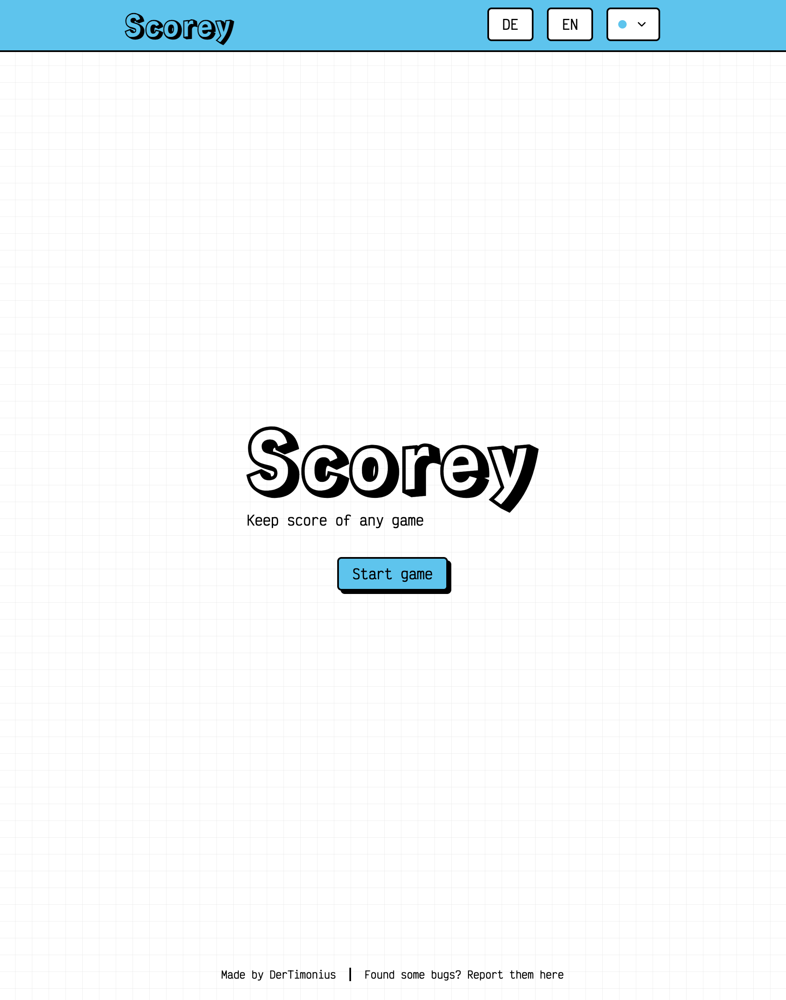
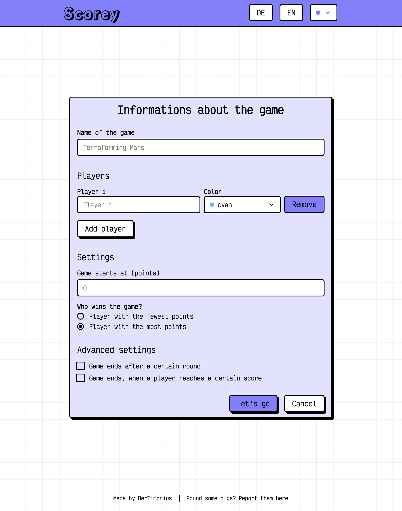
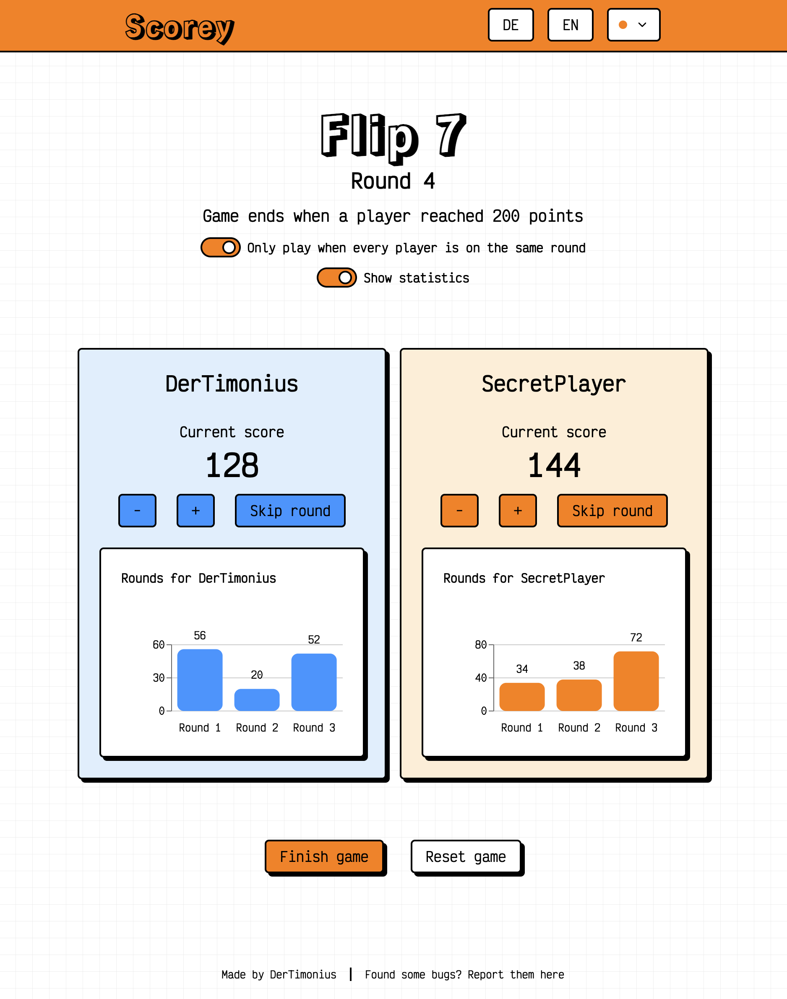

# Scorey

Scorey is a simple toy application designed to help users keep score while playing board games. It provides a user-friendly interface for tracking scores and managing game options.

## Features

- **Game Creation**: Users can create new games with various customizable options.
- **Player Management**: Add and remove players, assign names and colors.
- **Scoring**: Keep track of scores for each player during gameplay.
- **Game Options**: Configure game settings such as:
  - Starting score value.
  - Winning condition (e.g., highest score wins, lowest score wins).
  - Optional ending conditions based on rounds or scores (e.g., game ends after 10 rounds, or when a player reaches 100 points).
  - Option to end the game on the same round when a score condition is met.

## Thanks to

[neobrutalism.dev](https://neobrutalism.dev) for the components and charts
